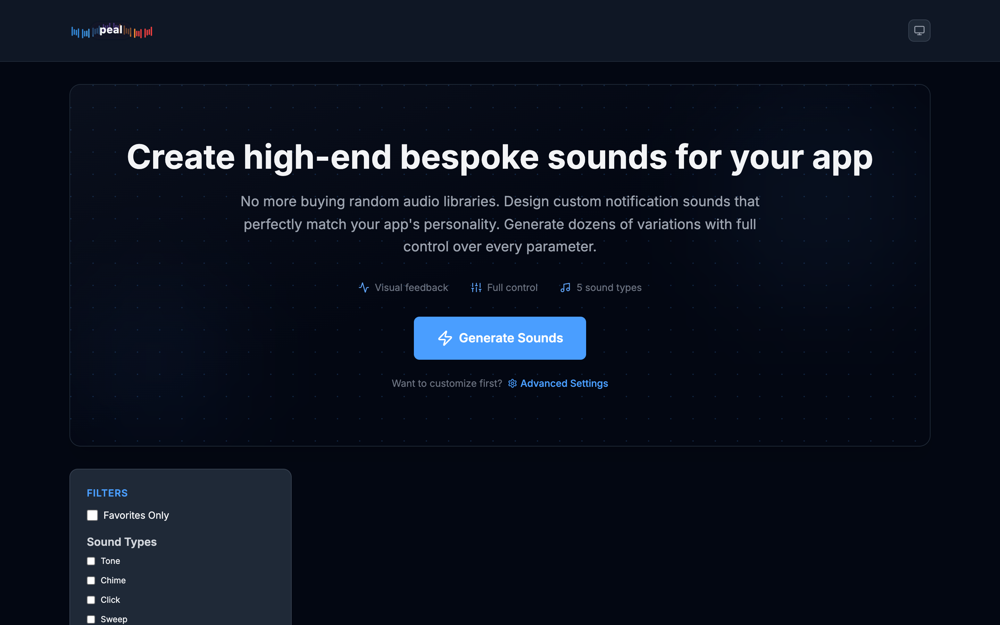

# 🎵 Peal - Web-Based Notification Sound Designer

<p align="center">
  
</p>

<p align="center">
  <strong>Take the driver's seat in creating unique notification sounds</strong>
</p>

<p align="center">
  <a href="#features">Features</a> •
  <a href="#getting-started">Getting Started</a> •
  <a href="#usage">Usage</a> •
  <a href="#sound-types">Sound Types</a> •
  <a href="#tech-stack">Tech Stack</a> •
  <a href="#contributing">Contributing</a>
</p>

---

## Overview

Peal is a professional web application for creating, exploring, and managing notification sounds with real-time visual feedback. Generate dozens of unique sounds with customizable parameters, visualize waveforms in real-time, and export your favorites for use in any application.



## ✨ Features

### 🎛️ Sound Generation
- **Batch Generation**: Create 50 unique notification sounds at once
- **Advanced Controls**: Fine-tune duration, frequency, effects, and sound types
- **Progressive Disclosure**: Simple interface for beginners, advanced settings for pros

### 👁️ Visual Feedback
- **Real-time Waveform Visualization**: See the sound signature of each generated sound
- **Beautiful UI**: Clean, modern interface with attention to spacing and hierarchy
- **Theme Support**: Light, dark, and system theme options

### 🎯 Sound Management
- **Favorites System**: Star your best sounds for quick access
- **Tagging**: Organize sounds with custom tags
- **Advanced Filtering**: Filter by type, duration, frequency, tags, and favorites
- **Bulk Operations**: Select and export multiple sounds at once

### 🔊 Audio Features
- **In-Browser Playback**: Preview sounds instantly without external software
- **Sound Editing**: Modify parameters and regenerate sounds
- **WAV Export**: Download individual or multiple sounds as WAV files

## 🚀 Getting Started

### Prerequisites

- Node.js 18+ 
- pnpm (recommended) or npm

### Installation

1. Clone the repository:
```bash
git clone https://github.com/yourusername/peal.git
cd peal
```

2. Install dependencies:
```bash
pnpm install
```

3. Run the development server:
```bash
pnpm dev
```

4. Open [http://localhost:3000](http://localhost:3000) in your browser

## 📖 Usage

### First Time Users

1. **Generate Your First Batch**: Click the prominent "Generate Sounds" button on the hero section
2. **Explore**: Listen to generated sounds by clicking the play button on each card
3. **Organize**: Star your favorites and add tags for organization
4. **Export**: Download individual sounds or export selected sounds in bulk

### Advanced Users

1. **Access Advanced Settings**: Click "Advanced Settings" to reveal generation parameters
2. **Customize Generation**:
   - **Duration**: 200ms - 1500ms
   - **Frequency**: 200Hz - 2000Hz
   - **Sound Types**: Toggle between Tone, Chime, Click, Sweep, and Pulse
   - **Effects**: Add Reverb, Delay, Filter Sweeps, Distortion, or Modulation
3. **Filter & Sort**: Use the sidebar to filter by type, tags, duration, and frequency

## 🎼 Sound Types

- **Tone**: Pure sine and square waves for clean notification sounds
- **Chime**: Harmonic sounds with multiple frequency components
- **Click**: Percussive sounds perfect for UI feedback
- **Sweep**: Ascending or descending frequency sweeps for attention-grabbing alerts
- **Pulse**: Rhythmic patterns ideal for ongoing notifications

## 🛠️ Tech Stack

- **Framework**: [Next.js 14](https://nextjs.org/) with App Router
- **Language**: [TypeScript](https://www.typescriptlang.org/)
- **Styling**: [Tailwind CSS](https://tailwindcss.com/) with custom design system
- **State Management**: [Zustand](https://github.com/pmndrs/zustand)
- **Audio**: Web Audio API
- **Icons**: [Lucide React](https://lucide.dev/)

## 🎨 Design System

Peal features a comprehensive design system with:
- Semantic color tokens for consistent theming
- Spacing system for visual rhythm
- Typography hierarchy
- Reusable component patterns
- Smooth animations and transitions

## 🤝 Contributing

Contributions are welcome! Please feel free to submit a Pull Request. For major changes, please open an issue first to discuss what you would like to change.

1. Fork the repository
2. Create your feature branch (`git checkout -b feature/AmazingFeature`)
3. Commit your changes (`git commit -m '✨ Add some AmazingFeature'`)
4. Push to the branch (`git push origin feature/AmazingFeature`)
5. Open a Pull Request

## 📝 License

This project is licensed under the MIT License - see the [LICENSE](LICENSE) file for details.

## 🙏 Acknowledgments

- Built with ❤️ using Next.js and the Web Audio API
- Logo design features a beautiful rainbow waveform representing the diversity of sounds you can create
- Special thanks to the open-source community for the amazing tools that made this possible

---

<p align="center">
  Made with 🎵 by the Peal Team
</p>