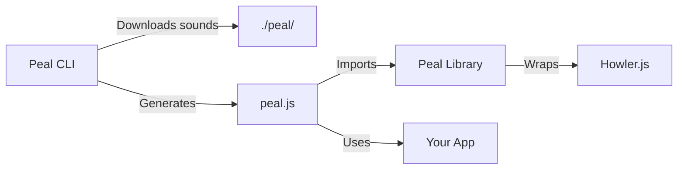

# Peal Library Overview

## What is Peal?

Peal is a sound effects library designed specifically for modern web applications. It combines:

- 🎵 **Professional UI sounds** - Curated, high-quality sound effects
- 🛠 **Smart CLI** - Manages sounds like package dependencies  
- 📦 **Tiny runtime** - Thin wrapper around battle-tested Howler.js
- 🚀 **Zero config** - Generated helper knows where your sounds live

## How It Works



1. **CLI downloads sounds** to your project
2. **Generates a helper** that knows all paths
3. **Your app imports** the generated helper
4. **Just call** `peal.click()` - it works!

## Key Features

### 🎯 Purpose-Built for UI

Unlike general audio libraries, Peal focuses on UI sound effects:
- Short, responsive sounds
- Optimized for user interactions  
- Professional quality audio
- Semantic naming (click, success, error)

### 📦 Managed Like Dependencies

```bash
# Add sounds like packages
npx @peal-sounds/peal add click success

# Remove when not needed
npx @peal-sounds/peal remove click

# See what you have
npx @peal-sounds/peal list
```

### 🪶 Lightweight Runtime

The Peal library is just a thin wrapper providing:
- Simple play/pause/stop methods
- Volume and mute controls
- TypeScript support
- Framework agnostic

### 🔧 Generated Integration

The CLI generates a perfect integration file:

```javascript
// peal.js - Generated automatically
import { Peal } from '@peal-sounds/peal';

const peal = new Peal();

// Pre-configured with your sounds
peal.load('click', './peal/click.wav');
peal.load('success', './peal/success.wav');

// Convenience methods
peal.click = () => peal.play('click');
peal.success = () => peal.play('success');

export { peal };
```

## Why Peal?

### vs. Using Howler.js Directly

```javascript
// Without Peal - Manual everything
import { Howl } from 'howler';

const sounds = {
  click: new Howl({ src: ['./sounds/click.mp3'] }),
  success: new Howl({ src: ['./sounds/success.mp3'] }),
  // ... repeat for every sound
};

sounds.click.play();
```

```javascript
// With Peal - Automatic setup
import { peal } from './peal';

peal.click();  // That's it!
```

### vs. Embedding Base64 Audio

```javascript
// Without Peal - Bloated bundle
const SOUNDS = {
  click: 'data:audio/wav;base64,UklGRiQFAABXQVZFZm...' // 50KB+ in your JS!
};
```

```javascript
// With Peal - Efficient loading
peal.click();  // Loads from optimized file
```

### vs. Using `<audio>` Tags

```javascript
// Without Peal - DOM manipulation
const audio = document.getElementById('click-sound');
audio.currentTime = 0;
audio.play();
```

```javascript
// With Peal - Clean API
peal.click();
```

## Architecture Benefits

### 1. Separation of Concerns
- **CLI** manages the sound files
- **Library** handles playback
- **Your code** stays clean

### 2. Progressive Enhancement
```javascript
// Graceful degradation built-in
if (peal) {
  peal.click();  // Plays if available
}
```

### 3. Performance Optimized
- Sounds loaded once, cached in memory
- Preloading handled automatically
- No bundle bloat from embedded audio

### 4. Developer Experience
- IntelliSense for all your sounds
- TypeScript types included
- No path management needed

## Use Cases

Perfect for:
- ✅ Form interactions (submit, error, success)
- ✅ Navigation feedback (clicks, hovers)
- ✅ Notifications and alerts
- ✅ Game-like interactions
- ✅ Progressive web apps
- ✅ Desktop apps (Electron, Tauri)

Not ideal for:
- ❌ Background music
- ❌ Long audio tracks  
- ❌ Complex audio processing
- ❌ Spatial/3D audio

## Technical Details

### Dependencies
- **Runtime**: Howler.js 2.2+
- **Node**: 16+ (for CLI)
- **Browsers**: All modern browsers

### File Structure
```
your-project/
├── peal/              # Downloaded sounds
│   ├── click.wav
│   ├── success.wav
│   └── error.wav
├── peal.js           # Generated helper
└── src/
    └── app.js        # Your code
```

### Sound Formats
- **Format**: WAV (uncompressed)
- **Quality**: 48kHz, 16-bit
- **Size**: 10-200KB per sound
- **Optimized**: For low latency

## Roadmap

Coming soon:
- 🎨 Sound packs (themes)
- 🎵 Web-based sound editor
- 📊 Analytics integration
- 🎮 Game sound pack
- 🌐 CDN hosting option