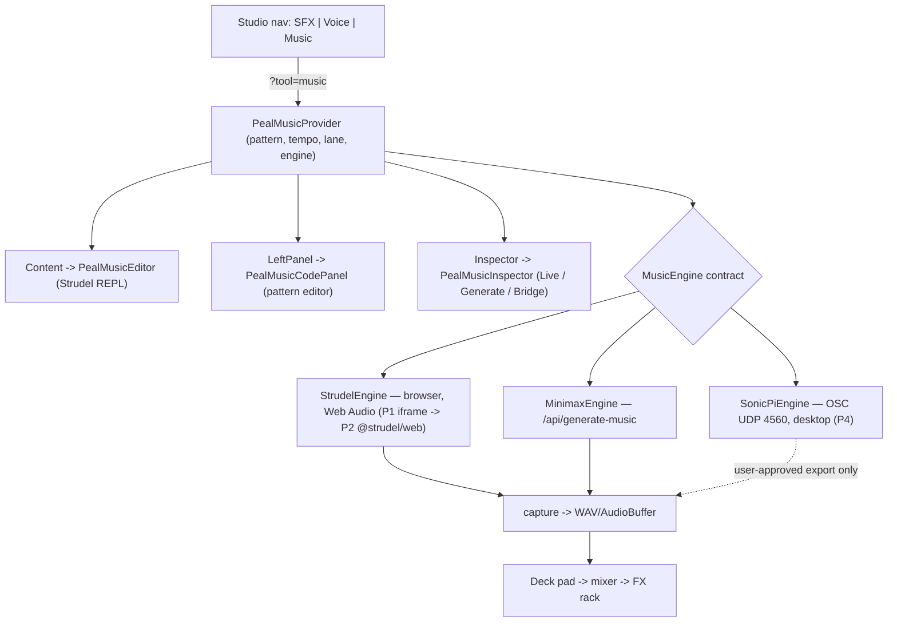
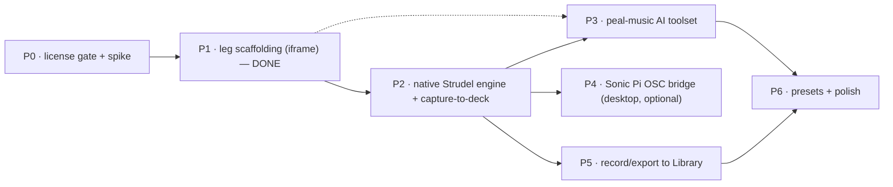

# peal-001 — Music Studio (Strudel × Minimax × Sonic Pi)

**Studio**: /eng/peal-001
**Status**: Phase 1 shipped (uncommitted WIP) · Phases 2–6 designed
**Owner**: peal.master (project-native) · handoff from arc-opus / Grok
**Date**: 2026-07-05
**Surface**: Next.js app, port 3001 · Hudson `AppShell` app at `app/hudson/peal-studio/`
**Related**: `docs/handoffs/music-studio-opus.md` (brief) · `docs/music-leg-strudel-sonicpi-integration.md` (deep analysis) · `docs/hudson-studio-spec.md`

---

## 1. Summary

Add a third tool leg — **Music** — to Peal Studio alongside **SFX** and **Voice**. The leg unifies three sound sources behind one deck-and-capture model:

| Lane | Engine | Runtime | Status |
|---|---|---|---|
| **Live Code** | Strudel (TidalCycles-in-JS) | Browser / Web Audio | Phase 1–2 |
| **Generate** | Minimax `music_generation` | REST (`/api/generate-music`) | exists in Voice deck; move in Phase 2 |
| **Bridge** | Sonic Pi | macOS desktop, OSC UDP 4560 | Phase 4, optional/gated |

**Guiding principle:** one leg, pluggable engines, unified capture. Every engine renders audio that **captures to a deck pad**, exactly like the Voice deck already does for TTS / Minimax / SFX (`app/hudson/peal-studio/voice/PealVoiceProvider.tsx`). Live-coded patterns, generative stems, and (later) OSC-driven Sonic Pi output all land on the same pad → mixer → FX rack.

**The single blocking decision** is Strudel's license (AGPL-3.0 vs Peal's MIT). Phase 1 sidesteps it with an **iframe embed** (arm's-length, reversible). Bundling `@strudel/web` (Phase 2) requires an explicit call — see §5.

### 1.1 Key finding — Phase 1 is already built and verified

The scaffolding requested in the brief's deliverable #6 already exists as uncommitted WIP and **compiles clean** (`/studio?tool=music` → HTTP 200 against the running dev server). It is more than an "empty shell": a working Strudel REPL, a pattern provider with persistence, a 3-lane inspector, and a code panel. See §8 for the verified inventory. Remaining work is Phases 2–6 below.

---

## 2. Current Peal Studio architecture (context)

- Hudson app registered in `app/hudson/peal-studio/index.ts` (`AppManifest` + slots `LeftPanel` / `Content` / `Inspector` + nav hooks).
- Leg selection via `?tool=` URL param, parsed in `routing.ts` (`PealStudioTool = 'sfx' | 'voice' | 'music'`).
- Provider tree in `Provider.tsx` nests per-leg providers; each slot component branches on `currentTool`.
- Nav: primary + context bar in `components/peal-nav/routing.ts`, rendered by `components/PealContextBar.tsx` (Studio → SFX / Voice / **Music**).
- Voice leg (`voice/`) is the structural template: providers → deck (`PealDeck`) → capture → programmable mixer → AI chat (`usePealVoiceAI`, toolset `lib/ai/toolsets/peal-voice.ts`).
- Minimax already lives **inside** the Voice deck (`generate_music` tool + `/api/generate-music`); Phase 2 promotes it to a first-class Music lane.

---

## 3. Architecture

### 3.1 Runtime



### 3.2 Engine adapter contract (Phase 2)

One contract, three implementations. Browser engines add live-eval hooks; all engines can render a fixed-length clip for capture.

```ts
// app/hudson/peal-studio/music/engine/types.ts
export interface MusicEngine {
  id: MusicEngineId                        // 'strudel' | 'minimax' | 'sonic-pi'
  kind: 'live-code' | 'generative'
  isAvailable(): boolean                   // desktop gate (sonic-pi), key gate (minimax)
  evaluate?(code: string): Promise<void>   // live-code: hot-swap the running pattern
  stop?(): void
  setTempo?(cps: number): void
  render(opts: { code?: string; prompt?: string; bars?: number }): Promise<AudioBuffer | Blob>
}
```

- **StrudelEngine** — the workhorse. `evaluate()` for jamming; `render()` via `OfflineAudioContext` for deterministic capture-to-WAV.
- **MinimaxEngine** — thin adapter over the existing `/api/generate-music` (`kind: 'generative'`, prompt-in / clip-out). No new backend.
- **SonicPiEngine** — Phase 4, desktop-only; `isAvailable()` returns `false` in the browser so the Bridge lane greys out.

### 3.3 Layout

Reuses `PEAL_STUDIO_SHELL_LAYOUT` unchanged — center = editor/visualizer, left = code, right = inspector. No new shell geometry.

---

## 4. Sonic Pi security posture (non-negotiable)

Sonic Pi's Ruby DSL has full machine access; Sam Aaron explicitly warns against **unattended AI `run_code`**. The bridge is therefore constrained to:

- **OSC triggers only** — Peal sends parameterized OSC messages to a Sonic Pi buffer the *user* has loaded (`live_loop` + `sync "/osc/..."`). Peal never ships arbitrary Ruby for blind eval.
- **User-approved export** — capture is an explicit, user-initiated action, not an AI side effect.
- **Desktop + install gated** — hidden in the browser; requires a Peal desktop shell (Tauri/Electron) + a user-installed Sonic Pi. `isAvailable()` false otherwise.

The `peal-music` toolset therefore exposes **no** free-form `sonic_pi_eval` in the browser; any P4 tool is desktop-only and triggers a pre-loaded buffer, never arbitrary code.

---

## 5. License recommendation (the gate)

**Strudel is AGPL-3.0-or-later; Peal is MIT.** AGPL §13's network clause means that *conveying/operating a combined work over a network* entitles users to that combined work's source.

**Recommendation — staged, reversible:**

1. **Phase 1 (now): iframe the upstream/standalone Strudel REPL** (`https://strudel.cc`). Peal *links to a separate work* rather than combining code — cleanest for a proprietary hosted app, zero bundle cost, AGPL stays at arm's length. **This is what Phase 1 ships.**
2. **Phase 2 decision point — pick one before bundling `@strudel/*`:**
   - **(a) Stay iframe / self-host the standalone REPL** as an isolated route with a source offer scoped to that route. Deepens control modestly without linking AGPL into Peal's app bundle.
   - **(b) Isolate the Strudel integration in a separately-licensed AGPL module** (`app/hudson/peal-studio/music/engine/strudel/**` published/offered under AGPL), keeping the rest of Peal MIT. Viable if we accept open-sourcing that seam.
   - **(c) Full bundle into the MIT app** — **not recommended** without legal sign-off; risks copyleft reaching the whole hosted app.
3. **Verify per-package** — confirm the exact license of each `@strudel/*` package and the sample-bank data before any bundle (some sub-packages/data may differ).

**Sonic Pi (GPL-3.0):** no linking — Peal drives a *separately-installed* process over OSC, so the copyleft boundary is never crossed by Peal's code. The obligation stays with the user's install.

> **Do not bundle `@strudel/web` until 5.2 is decided.** Default recommendation: **(b) isolated AGPL engine module** — deepest Strudel control with a clean license boundary — or hold at **(a)** if we want to keep the whole tree MIT.

---

## 6. Phase DAG



Edges are hard deps except the dashed `P1 -.-> P3` (the toolset *scaffolding* + `describe_to_pattern` writing into the textarea can land on the iframe MVP, but the AI's `evaluate`/`render_capture` tools only become useful once P2 provides in-process eval + capture).

### PR-sized chunks + file touch list

Legend: **M** modify · **N** new. Paths relative to repo root.

**PR-1 — Music leg scaffolding (iframe MVP) · ✅ DONE (uncommitted)**
Registers the leg so `?tool=music` routes, the nav pill appears, and a Strudel REPL renders.
- **M** `app/hudson/peal-studio/routing.ts` — `music` in `PealStudioTool` union, `PEAL_STUDIO_TOOLS`, `parsePealStudioTool`, `applyPealStudioToolParam`.
- **M** `Content.tsx` · `Inspector.tsx` · `LeftPanel.tsx` — branch `currentTool === 'music'`.
- **M** `hooks.ts` — `TOOL_LABELS`/`TOOL_DESCRIPTIONS`/`TOOL_ORDER`, `MusicIcon` switch, status/nav-center/nav-actions (play toggle), status-left.
- **M** `index.ts` — manifest command `peal-studio:switch-music`.
- **M** `intents.ts` — "Switch to Music Studio" intent.
- **M** `Provider.tsx` — mount `PealMusicProvider`.
- **M** `components/icons/PealStudioIcon.tsx` — `MusicIcon`.
- **N** `components/peal-nav/routing.ts` — `music` context id + Studio nav item (rendered by `PealContextBar.tsx`).
- **N** `app/hudson/peal-studio/music/{PealMusicEditor,PealMusicProvider,PealMusicInspector,PealMusicCodePanel,constants,types}.{tsx,ts}`.
- **Exit (met):** `/studio?tool=music` shows a working Strudel REPL; pattern textarea persists to `localStorage`; nav/status/transport reflect the leg. *Verified: HTTP 200.*

**PR-2 — Engine contract + native Strudel + capture-to-deck** *(license gate 5.2 first)*
- **M** `package.json` — add `@strudel/web` (+ `@strudel/codemirror`, `@strudel/transpiler`, `@strudel/tonal`, `@strudel/soundfonts` as needed). *Gated by §5.*
- **N** `music/engine/types.ts` — `MusicEngine` contract (§3.2).
- **N** `music/engine/StrudelEngine.ts` — `initStrudel()` / `evaluate` / `stop` / `setTempo` + `render()` via `OfflineAudioContext`.
- **N** `music/engine/MinimaxEngine.ts` — adapter over `/api/generate-music`.
- **M** `music/PealMusicEditor.tsx` — swap iframe → CodeMirror editor + transport (gesture-gated `AudioContext` unlock).
- **N** `music/capture.ts` — offline render → WAV Blob → deck pad.
- **Deck unification (recommended):** promote the deck out of `voice/` into shared `app/hudson/peal-studio/deck/` so Music and Voice share pad/capture/mixer instead of forking. Touches `voice/PealDeck.tsx`, `voice/PealVoiceProvider.tsx`.
- **Exit:** live-code a pattern → capture → playable deck pad through the existing mixer/FX.

**PR-3 — `peal-music` AI toolset** (see §7)
- **N** `lib/ai/toolsets/peal-music.ts` — `ToolsetDefinition` mirroring `peal-voice.ts`.
- **M** `lib/ai/toolsets/index.ts` — `register('peal-music', pealMusicToolset)`.
- **M** `app/api/ai/chat/route.ts:14` — add `'peal-music'` to `PEAL_LOCAL_TOOLSETS`.
- **N** `lib/ai/musicPatternExamples.ts` — few-shot Strudel mini-notation grounding (mirror `voiceDesignExamples.ts`).
- **N** `music/{PealMusicAIProvider,PealMusicAIChat}.tsx`, `music/usePealMusicAI.ts` — mirror the voice AI trio; POST `/api/ai/chat` with `toolset: 'peal-music'` + context; resolve tool calls against `PealMusicProvider`.
- **M** `Provider.tsx` — nest `PealMusicAIProvider`.
- **Exit:** "lo-fi 4-bar bassline at 82 bpm" → AI writes Strudel into the editor, evaluates, can capture to a pad; "warm ambient bed" can route to Minimax instead.

**PR-4 — Sonic Pi OSC bridge (desktop, optional)** — §4 constraints; `SonicPiEngine.ts` + Tauri/Electron OSC sidecar; feature-gated. Only if Peal ships a desktop shell.

**PR-5 — Record/export to Library** — deck pad → Library entry (reuse existing Library export path); pattern permalink via Strudel's URL-hash encoding.

**PR-6 — Presets + polish** — `music/presets.ts` starter catalog (drums/bass/arps/beds) in the left panel; pattern-code versioning in `music/storage.ts`; WebMIDI out; finish deck unification.

---

## 7. AI tool design — `peal-music` toolset

Follows the `peal-voice.ts` shape exactly: a `ToolsetDefinition = { system, context, tools }` where each `tool({ description, inputSchema: z.object(...), execute })` is **client-resolved** — `execute` returns `{ applied: true, ...args }` and the real effect happens in `usePealMusicAI` against `PealMusicProvider` (identical to how `usePealVoiceAI` drives `generate_music` today). Server side, `app/api/ai/chat/route.ts` streams via pi-ai (`lib/ai/host.ts`); just add `'peal-music'` to `PEAL_LOCAL_TOOLSETS`.

**`system`** — teach the model to be a Strudel live-coder *and* a Minimax prompt-writer: mini-notation (`"c3 e3 g3"`, `[a b]`, `<a b>`, `a*2`, `a(3,8)` Euclid), core functions (`note`, `s`/`sound`, `n`, `stack`, `slow`/`fast`, `rev`, `jux`, `every`, `gain`, `room`, `lpf`, `.cpm`/`.cps`), sample banks/soundfonts; when to **write deterministic code** vs **generate** a timbre-rich bed via Minimax; always leave runnable code; prefer small edits over rewrites. Accent is blue `#4a9eff`.

**`context(ctx)`** — inject live state: current pattern code, tempo (cps/bpm), selected lane/engine, available sample banks, deck bank/pad state, and availability flags for Minimax (`MINIMAX_API_KEY`) and Sonic Pi (desktop).

**`tools(ctx)`**

| Tool | Purpose | Input (Zod) | Phase |
|---|---|---|---|
| `describe_to_pattern` | **Flagship** — NL → Strudel code written into the editor | `{ description, bars?, style? }` | P3 (works on iframe) |
| `write_pattern` | Replace editor code directly | `{ code }` | P3 |
| `edit_pattern` | Targeted edit (add layer, change instrument, tweak rhythm) | `{ instruction }` | P3 |
| `evaluate_pattern` | Hot-swap / run current code | `{}` | P3 (needs P2 engine) |
| `set_tempo` | Set cps/bpm | `{ bpm?, cps? }` | P3 |
| `layer_track` | Stack a part via `stack` | `{ role: 'drums'\|'bass'\|'lead'\|'pad', pattern }` | P3 |
| `render_capture` | Offline-render N bars → WAV → deck pad | `{ bars?, padLabel? }` | P3 (needs P2 capture) |
| `set_music_prompt` | Set Minimax instrumental prompt | `{ text }` | P3 (reuses voice tool) |
| `generate_music` | Generative clip via Minimax → deck pad | `{ prompt? }` | exists |
| `explain_pattern` | Read current code back in plain English | `{}` | P3 |
| `sonic_pi_trigger` *(desktop)* | Fire an OSC trigger to a **user-loaded** buffer — never arbitrary Ruby | `{ oscPath, args? }` | P4 |

Grounding: `lib/ai/musicPatternExamples.ts` few-shots for reliable mini-notation. **No `sonic_pi_eval`** — §4.

**Target UX moment:** *"lo-fi hip-hop bed, dusty, 78 bpm, 8 bars"* → `describe_to_pattern` writes a `stack(...)` at `.cpm(78/4)` → `evaluate_pattern` (plays) → "warmer" → `edit_pattern` adds `.room(.4).lpf(1200)` → `render_capture` drops an 8-bar WAV on a pad. One intent later, "make it a real vinyl mix" routes to `generate_music` (Minimax) — deterministic code and generative audio side by side on one deck.

---

## 8. Verified current inventory (Phase 1 WIP)

Untracked/modified, compiles clean, `/studio?tool=music` → **HTTP 200**:

- `app/hudson/peal-studio/music/PealMusicEditor.tsx` — Strudel iframe (`allow="midi; microphone; autoplay"`) + open-fullscreen link.
- `music/PealMusicProvider.tsx` — `patternCode` (persisted to `peal-music-pattern-v1`), `lane`, `engineId: 'strudel'`, `isPlaying`, `resetPattern`; `usePealMusic` / `useOptionalPealMusic`.
- `music/PealMusicInspector.tsx` — `StudioModuleTabs` Live / Generate / Bridge, phase-annotated copy.
- `music/PealMusicCodePanel.tsx` — pattern `<textarea>` + reset.
- `music/constants.ts` — `DEFAULT_STRUDEL_PATTERN`, `STRUDEL_REPL_ORIGIN`.
- `music/types.ts` — `MusicLane`, `MusicEngineId`.
- Wiring: `routing.ts`, `Content.tsx`, `Inspector.tsx`, `LeftPanel.tsx`, `hooks.ts`, `index.ts`, `intents.ts`, `Provider.tsx`, `components/icons/PealStudioIcon.tsx`, `components/peal-nav/routing.ts`.

**Not yet committed.** Per repo convention the maintainer commits; no `Co-Authored-By` trailer.

---

## 9. Risks & mitigations

| Risk | Mitigation |
|---|---|
| **Strudel AGPL** on a proprietary app | §5 staged plan; iframe-first (shipped); isolate AGPL engine module if bundling; per-package verify. |
| **Sonic Pi arbitrary eval** | §4 — OSC triggers to user-loaded buffers + user-approved export only; no browser `sonic_pi_eval`. |
| **Bundle size** (Strudel core + CodeMirror + banks) | Lazy-load the whole `music/` leg on `?tool=music`; CDN sample banks on demand; iframe keeps main bundle untouched. |
| **Autoplay / AudioContext** gating | Require a user gesture before `initStrudel()`; reuse Peal's Web Audio unlock. |
| **Offline-render fidelity** | Ensure banks/soundfonts loaded before `OfflineAudioContext`; verify tempo↔bar math for seamless loops. |
| **CPS ↔ deck BPM mismatch** | Store tempo on the clip; convert Strudel cps → deck bpm at capture; expose tempo in AI context. |
| **Deck fork drift** | Unify deck into shared `deck/` in PR-2, not copy-fork `voice/`. |

---

## 10. Open decisions (need a human call)

1. **License strategy (§5.2)** — before PR-2 bundles `@strudel/web`: stay iframe/self-host **(a)**, isolate an AGPL engine module **(b, recommended)**, or full bundle **(c, needs legal)**.
2. **Desktop shell** — is a Tauri/Electron Peal on the roadmap? That single fact decides whether PR-4 (Sonic Pi) is ever in scope.
3. **Deck unification timing** — extract shared `deck/` in PR-2 (recommended) or defer and accept temporary fork.
4. **Commit PR-1** — the Phase-1 WIP is verified but uncommitted; ready to commit on request.
